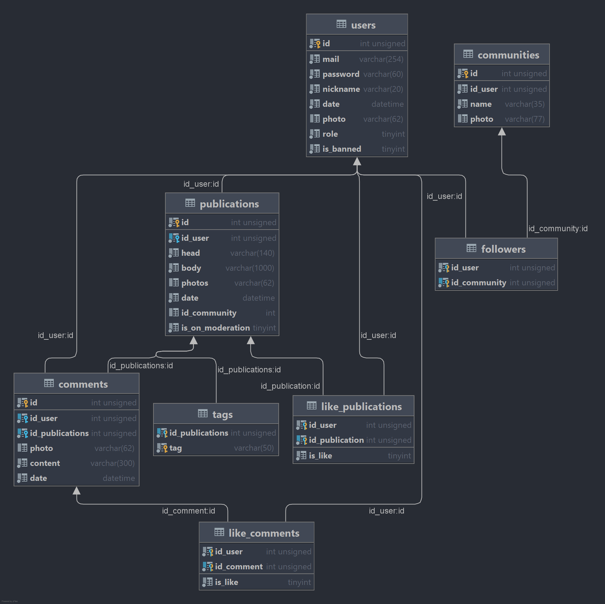

# Infotainment community 
Description : Keddit is an infotainment community where users 
can share funny or informative stories, facts, put likes or dislikes
to them, comment them ,create communities and join them
### User roles and functions available to them:
|function| ADMIN| MODERATOR | USER |
|---------|-------|------|----------|
|change language|	* |	* |	* |
|create community| * | * | * |
|create publication| * | * | * |
|create comment| * | * | * |
|edit own community| * | * | * |
|edit own publication| * | * | * |
|edit own user| * | * | * |
|like\dislike community\publication| * | * | * |
|follow\unfollow community | * | * | * |
|search smth| * | * | * |
|like\dislike community\publication| * | * | * |
|follow\unfollow community | * | * | * |
|search smth| * | * | * |
|accept\deny publications on moderation| * | * | |
|edit foreign community| * | | | 
|edit foreign publication| * | | |
|edit foreign user| * | | |
|delete foreign community| * | | | 
|delete foreign publication| * | | |
|delete foreign user| * | | |
|change role| * | | |
|ban\unban users| * | | |

# Database tables

## Analogs:
* YaPlakal
* Pikabu
* Reddit