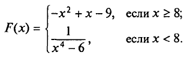
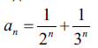

1.Подсчитать количество положительных чисел среди a , b и с

2.Составить программу: равны ли два числа а и b?

3.Даны три точки А(х1,у1), В(х2,у2) и С(х3,у3). Определить, будут ли они расположены на одной прямой.

4.Даны два угла треугольника (в градусах). Определить, существует ли такой треугольник, и если да, то будет ли он прямоугольным.

5.Вычислить значение функции:

6.Даны числовой ряд и некоторое число е. Найти сумму тех членов ряда, модуль которых больше или
равен заданному е. Общий член ряда имеет вид:

7.С помощью оператора while напишите программу вывода всех четных чисел в диапазоне от 2 до 100
включительно.

8.Даны два числа. Определить цифры, входящие в запись как первого так и второго числа.

9.Дано натуральное n. вычислить: 1 + 1/2 + 1/3 + 1/4 + ... + 1/n.

10.В трехзначном числе зачеркнули старшую цифру. Когда полученное число умножили на 7, то получили исходное число. Найти это число.